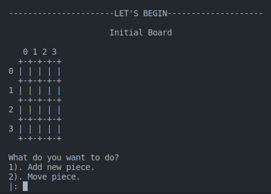
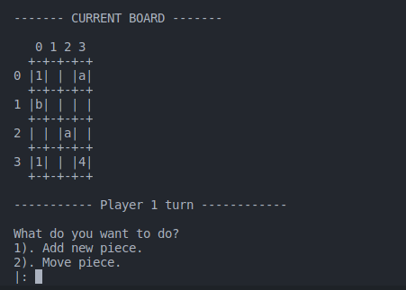
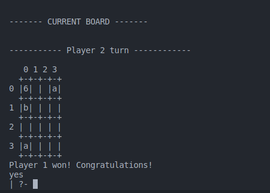
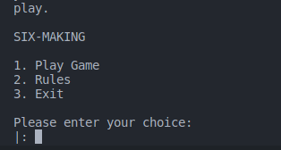
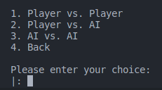

# Six Making - Grupo 5

## Topic and Group
- up202108802 - Carolina Teixeira Lopes Couto Viana - 50%
- up202108681 - Sérgio André Correia Peixoto - 50%

------------------------------------

## Installation and Execution

To install the game, you need to download and extract the content of the folder PFL_T1_T06_Six Making_5.zip.
Inside the src directory, consult the file main.pl and run the predicate play/0 to start the game.

---------------------------

## Description of the game

Six MaKING is a game for 2 players, played on a 5x5 (or 4x4) board. 

Each player alternate turns playing. When it is your turn you can:

 1. Place a new disk on the board (**Pawn**) on any empty square
 2. Move a tower (or part of one) to a non-empty square
       <br>a. **Move 1 piece of the tower** (**Pawn**): moves a single square in all 4 directions (up, down, right, left) on top of another tower.
       <br>b. **Move 2 pieces of the tower** (**Rook**): moves any number of squares in all 4 directions until the first tower in its path.
       <br>c. **Move 3 pieces of the tower** (**Knight**): moves in L shape on top of another tower.
       <br>d. **Move 4 pieces of the tower** (**Bishop**): moves any number of squares diagonally until the first tower in its path.
       <br>e. **Move 5 pieces of the tower** (**Queen**): moves any number of squares
       in all 8 directions until the first tower in its path.
 
Players can choose how many pieces of a tower they want to move, as long as it is a valid move.

If you only choose to move a part of a tower, the disks move as the original tower, before being split.

You cannot undo the opponents move.

The game ends when the first tower consisting of six or more disks (King) is built. The player who has its color on top is the winner. There are no draws in this game.

---

### Official Rules
  [Six MaKing](http://www.boardspace.net/sixmaking/english/Six-MaKING-rules-Eng-Ger-Fra-Ro-Hu.pdf)

---

### Game Logic

#### Internal Game State Representation

The Game State is composed of two parts: the Board and the Player currently taking turn playing.

  * The **Board** is a **list of lists**, each list representing a row of the board. Each element of the list is a piece on the board or ´empty´ if the square is **empty**.

  * Each **Piece** is then represented as another list: this list being composed of the **height** of the tower (in the head of the list) follow by the pieces of the tower ifself. Colors are represented using numbers `1` to `6` to represent white pieces, and letters `a` to `f` to represent black pieces. Given this, an example tower would be represented as `[4, 1, b, c, 4]`.

  * The **Board** and the **Player** are joined together to form the **Game State** (Board-Player).

  In this game, there are no captured piece, and both players can move all pieces, so that information didn't need to be represented.

    Initial Board Example
  
    

    Intermediate Board Example

    

    Final Board Example

    

#### Game State Visualization

The game visualization and interaction as separated into different modules: `play.pl` and `board.pl`

* #### play.pl
  This module is responsible for handling aspects such as showing menus and validating menu inputs

  `display_menu` - Shows the main menu of the game

  

  `first_menu_input(+Input)` - Validates the input of the main menu and calls the chosen menu

  `play_menu` - Shows the play menu of the game where the user can select the game mode

  
  

  This pattern repeats for the other menus of the game where its needed to select the size of the board of the game or the difficulty of the AI.

  The predicates used for these menus are:
  - `second_menu_input(+Input)` - Validates the input of the play menu and allows the user to choose the difficulty of the game
  - ```board_size_menu(+TypeOfGame)``` and ```valid_board_size_input(+Input) ```

  The last predicate called is `game_mode(+TypeOfGame, +SizeOfBoard)` that displays the initial state of the game and starts the game cycle.
  
* #### board.pl

  This module is responsible for drawing the board and the pieces of the game.

  `display_game(+Board)` - Draws the board of the game

  `initial_state(+Size, -GameState)` - Creates the initial state of the game given the size N of the board

  `p_m(+Matrix, +N, +M)` - Lower level predicate used by display_game to print the board matrix with the coordinates of the board

#### Move Validation and Execution
  
  During the game, the user has the option to choose two types of moves: `place` and `move`. Because of this we had to adapt the predicates to account for this, so there are two lower level predicates responsible for placing and moving pieces on the board:

  * `add_new_piece(+Board, +X, +Y, +Piece, -NewBoard)` - Which takes a piece and the coordinates where you want it to be and places it on the board, returning the new board
      * The predicate checks if the desired coordinates are empty (validation) and, if so, places the piece.

  * `move_piece(+Board, +X1, +Y1, +X2, +Y2, +N, -NewBoard)` - Which takes the coordinates of the piece to be moved (X1,Y1) and the coordinates of where you want it to move (X2,Y2). It also has an argument to specify the number of pieces to be moved (N), if the piece has a height of more than 1. It returns the new board with the moved piece.

  But before these predicates are called, the user input is validated by the following predicates:

  * `valid_coords(+Board, +X, +Y, +N, -Result)` - Which takes the height of the piece as an argument and returns the possible coordinates of the board where the piece can be moved to. This result list will be used to validate if a move if valid or not.

  * `get_piece(+Board, +X, +Y, ?Piece)`
     - To move a piece: ensure that the piece is not moved to an empty square on the board.
     - To place a new piece: verify if a `place` move is possible on those coordinates by giving the piece empty as an argument


  
  The above predicates are the "core" predicates that are responsible for, ultimately, moving the pieces. However, depending on which game mode we are on, the way the move is decided varies.

  AI Level 2 player uses the following predicate:

  * `move(+GameState, +Move, -NewGameState)` - Which takes the current game state, the move to be made and returns the new game state.

  The other players (Human and AI) use the following predicate:
  
  * `single_play(+Option, +GameState, +Player, -NewGameState)` - Which takes the option chose by the user, or the option chosen randomly by the AI player on Level 1 and either places a piece or moves a piece, returning the new game state.

#### List of Valid Moves

  Due to the nature of game, any player can move any piece on the board as long as it is a valid move or place any piece on the board as long as the square is empty. Because of this, we didn´t need to pass the player as an argument to the predicate as there is no restriction on the moves that can be made (player based restrictions at least):

  * `valid_moves(+Board, -ListOfMoves)` - Which takes the current board and returns a list of all the possible moves (place or move piece) that can be made on the board.

  This predicate is used by the AI Level 2 to later choose a move to make.

  Each element in the return list represents a move that can be made and is in the format `[Type, Action]` where **Type** is either `place` or `move`, **Action** has the initial and final coordinates of the move in the case **Type** is `move` or the coordinates of the square to place the piece and the piece itself in the case **Type** is `place`.

#### End of Game

  Checking whether the game has ended or not is done by the following predicate:

  * `game_over(+GameState, -Winner)` - Which check if there is a piece with a height of 6 or greater in the board, if there is, it returns the player that won the game. This will recursively check the board until it finds a piece with a height of 6 or greater and fails if it doesn´t find any.

  This check is done for every cycle in the game loop, so the game ends as soon as a player makes a move that results in a tower with a height of 6 or greater.

#### Game State Evaluation

  In order for the AI Level 2 to better choose a move to make, we had to create a predicate that would evaluate the current state of the game and return a value that would represent how good is that play. This predicate is the following:

  * `value(+Board, -Value)` - Which returns the value of the current board. To calculate the value we chose to use 3 different criteria in which we hope would give better choices. These are as such:

    * **Height of the tallest tower on the board** - The taller the tower, the better that play was, in hopes that the AI would choose to build a taller tower, as this is the main objetive of the game. This has a weight of 60% in the final value.

    * **Average height of the towers on the board** - The higher the average height of the towers in the board, the more options there are to reach higher towers in later moves. This has a weight of 30% in the final value.

    * **Number of towers in the board** - In the same way as the previous criteria, the more towers there are in the board, the more options there are to reach higher towers in later moves. This has a weight of 10% in the final value.
  
  Again, this predicate was modified to not include the player as an argument as there is no restriction on the moves that can be made.

#### Computer Plays

  The computer has 2 distinct levels it can play on:
  
  * **Level 1** - The computer will choose a random move from the list of valid moves and execute that move, in the same way a human would choose the type of move and then what to do in that same type of play.

  * **Level 2** - The computer will choose the move that will result in the best value of the board. This is done using a greedy algorithm that will search for the best move two moves ahead of the current state of the game, taking into consideration that the next play will be from the opponent and that the opponent will choose the best play for him (minimax algorithm). Theses decisions are made using the `value/2` predicate described above.

---

### Conclusions

  The game Six MaKing was sucessfully implemented in SICStus Prolog 4.8. The game can be played in 4 different modes:

  * **Player vs Player**
  * **Player vs Computer (Level 1)**
  * **Player vs Computer (Level 2)**
  * **Computer (Level 1) vs Computer (Level 1)**

  The size of the board can also be changed to whatever size wanted.

  One of the main challenges of this project was adapting our way of thinking outside of Object Oriented Programming and into Logic Programming. This was especially hard in the earlier stages when we had to think of ways to represent the game state and the pieces on the board

  One aspect that could be improved with more time would be the code itself. As this is our first time working with Prolog, we had to learn the language as we went along, so there are some parts of the code that could be improved and made more efficient as well as more clean, readable and reusable.

  Other aspect would be improving the AI Level 2. As this is dependent on the `value/2` predicate formula we chose, we would need more time to discover patterns in this AI and improve it to make better choices.

---

### Bibliography

  * [Sicstus Prolog](https://sicstus.sics.se/documentation.html)
  * [SWI Prolog](https://www.swi-prolog.org/)